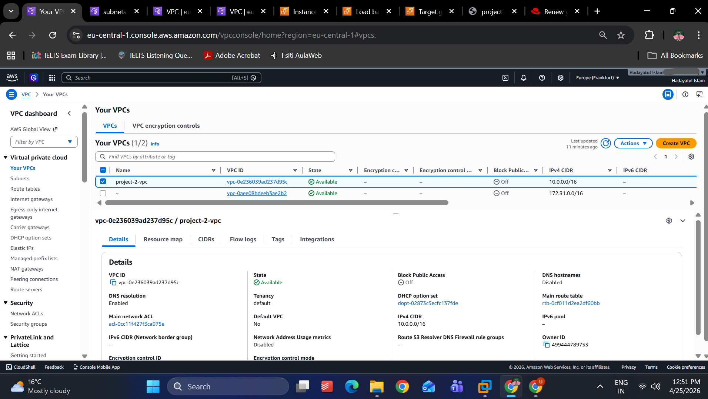
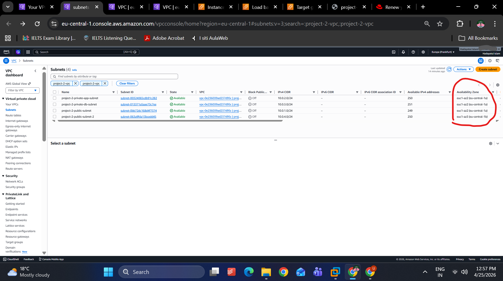
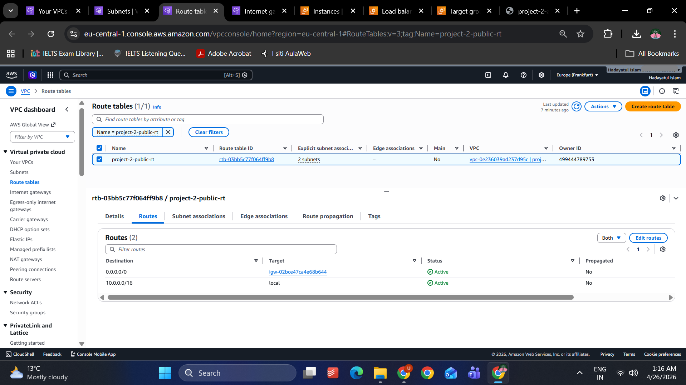
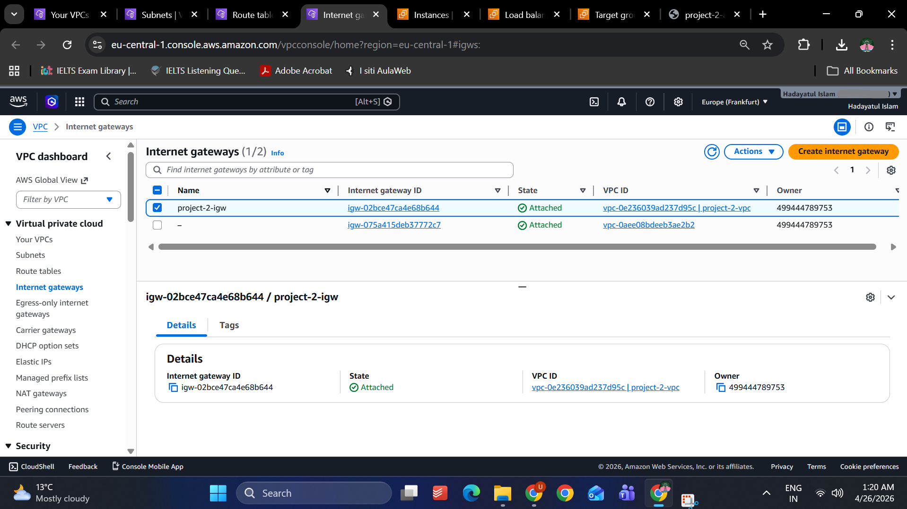
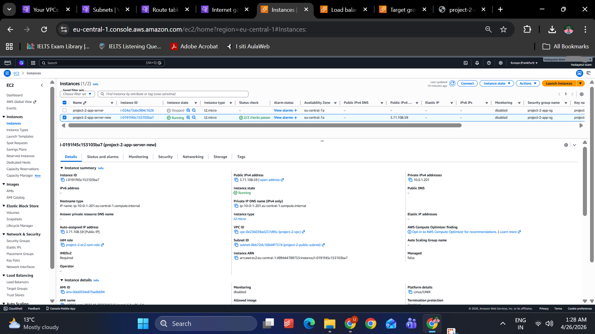
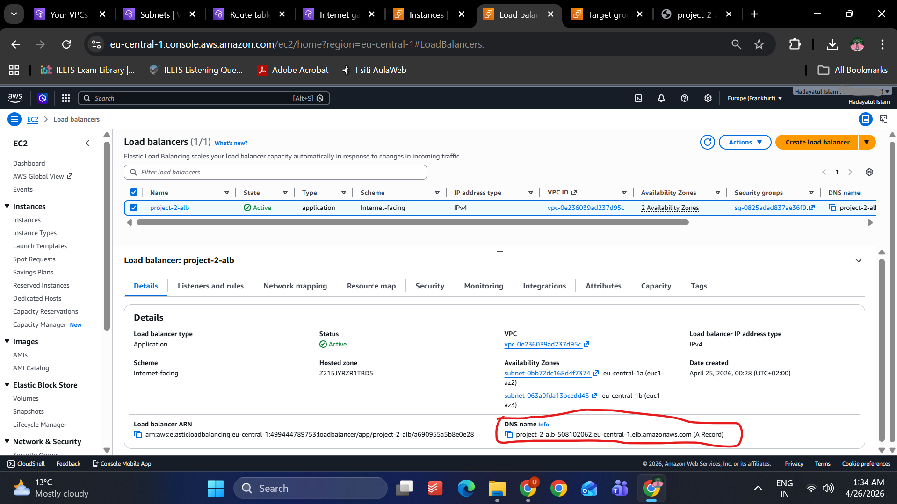
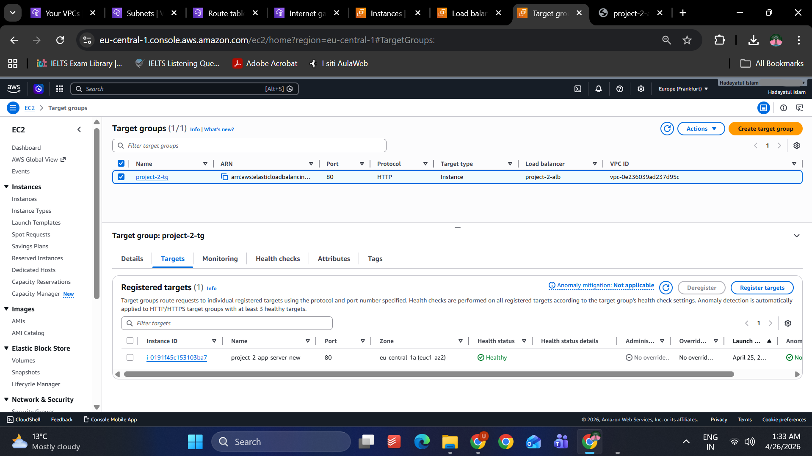
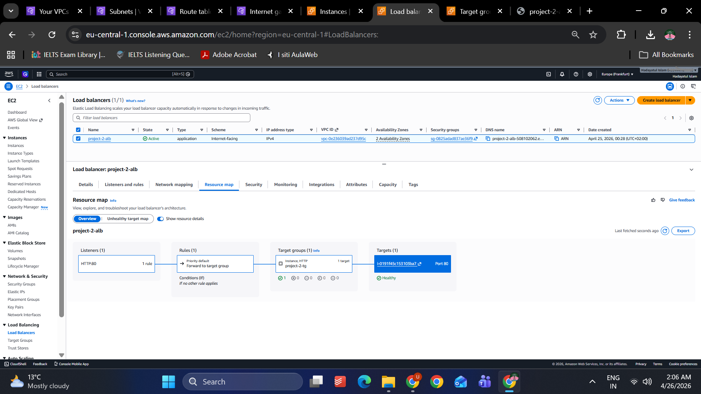
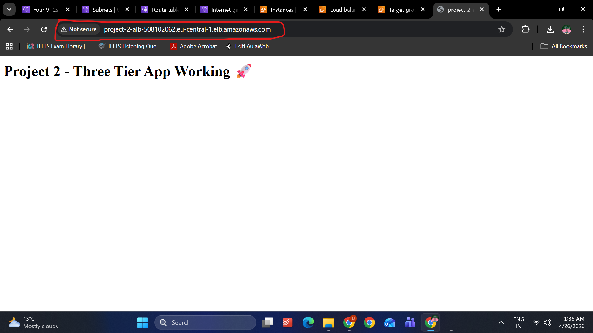

# AWS Project 2 – Two-Tier Web Application with Application Load Balancer


## Overview
This hands-on AWS project demonstrates the design and deployment of a two-tier web application architecture using core AWS networking and compute services.

The goal of this project was to build a scalable and highly available foundation where user traffic is distributed through an Application Load Balancer (ALB) to an EC2 web server hosted inside a custom Amazon VPC.

This project also serves as the foundation for a future expansion into a full three-tier architecture by integrating Amazon RDS as the database layer.

---

## Architecture

Traffic Flow:

```text
User
 ↓
Application Load Balancer
 ↓
EC2 Web Server
```
Architecture Components:

- Custom Amazon VPC (10.0.0.0/16)
- Public and Private Subnet Design
- Multi-AZ deployment across eu-central-1a and eu-central-1b
- Internet Gateway for external connectivity
- Public Route Table with IGW route
- Security Groups for traffic control
- Application Load Balancer for traffic distribution
- EC2 Web Server (Apache)
- Target Group health checks

---

## Objectives
This project was built to practice:

- Designing custom AWS networking
- Understanding subnet segmentation
- Configuring internet connectivity
- Deploying and securing EC2 workloads
- Implementing load balancing
- Validating target health and traffic flow

---

## AWS Services Used

- Amazon VPC
- Amazon EC2
- AWS Identity and Access Management (IAM)
- AWS Systems Manager (SSM)
- Application Load Balancer (ALB)
- Target Groups
- Security Groups
- Route Tables
- Internet Gateway

---

## Implementation Steps

### 1. Created Custom VPC
Configured a dedicated VPC:

- CIDR:
10.0.0.0/16

Designed isolated networking for the application.

---

### 2. Configured Subnets
Created:

Public:
- 10.0.1.0/24 (eu-central-1a)
- 10.0.4.0/24 (eu-central-1b)

Private:
- 10.0.2.0/24 (Application)
- 10.0.3.0/24 (Reserved private subnet for future RDS database tier)

Implemented multi-AZ design for availability.

---

### 3. Configured Internet Access
- Attached Internet Gateway
- Configured public route table
- Added:

0.0.0.0/0 → Internet Gateway

---

### 4. Deployed EC2 Web Server
Launched Amazon Linux EC2 instance and configured:

- Apache web server
- Custom landing page
- Security group rules for:
  - HTTP (80)
  - SSH (22)

---

### 5. Configured IAM Role for EC2 Management
Attached an IAM role to the EC2 instance to enable secure Systems Manager (SSM) access without relying on SSH as the primary management method.

Role used:
- EC2 IAM Role for Systems Manager access

Purpose:
- Secure instance management
- Session Manager access
- Reduced dependency on direct SSH access
- Introduction to IAM role-based access control

---

### 6. Configured Application Load Balancer
Built internet-facing ALB across two Availability Zones.

Configured:
- Listener on port 80
- Target Group
- Health checks
- Traffic forwarding to EC2 instance

---

### 7. Validated End-to-End Traffic Flow
Verified application accessibility through:

- EC2 Public IP
- ALB DNS endpoint

Confirmed healthy target registration and successful traffic routing.

---

## Architecture Screenshots

### VPC Overview


### Multi-AZ Subnet Design


### Public Route Table


### Internet Gateway


### EC2 Web Server


### Application Load Balancer


### Target Group Health


### Architecture Resource Map


### Working Website Through ALB


---

## Skills Demonstrated
This project helped demonstrate practical skills in:

- VPC Networking
- Multi-AZ Architecture
- Public / Private Subnet Design
- Route Table Configuration
- Security Group Configuration
- EC2 Deployment
- IAM role attachment for EC2
- Systems Manager based administration
- Load Balancing
- Health Checks
- Basic High Availability Design

---

## Lessons Learned
- Designing VPCs and subnet segmentation in practice
- Understanding ALB and target health checks
- Managing EC2 through IAM roles and Systems Manager
- Troubleshooting real AWS deployment issues

---

## Future Improvements
Planned next steps:

- Expand into full Three-Tier Architecture
- Add Amazon RDS Database Layer
- Add Auto Scaling Group
- Add Monitoring with CloudWatch
- Add Infrastructure as Code using Terraform

---

## Key Takeaways
Through this project I gained practical experience in how networking, compute, and load balancing components work together in AWS to support scalable web applications.

This project strengthened my understanding of cloud architecture beyond certification theory through hands-on implementation.

---

## Author
Hadayatul Islam  
CCNA Certified  
AWS Solutions Architect Associate Candidate  
Aspiring Cloud & Network Engineer  

GitHub: https://github.com/Hadayatulislam76
